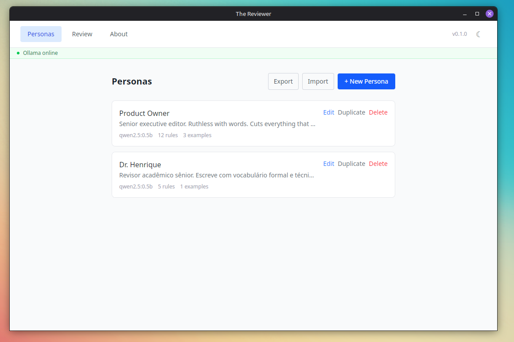
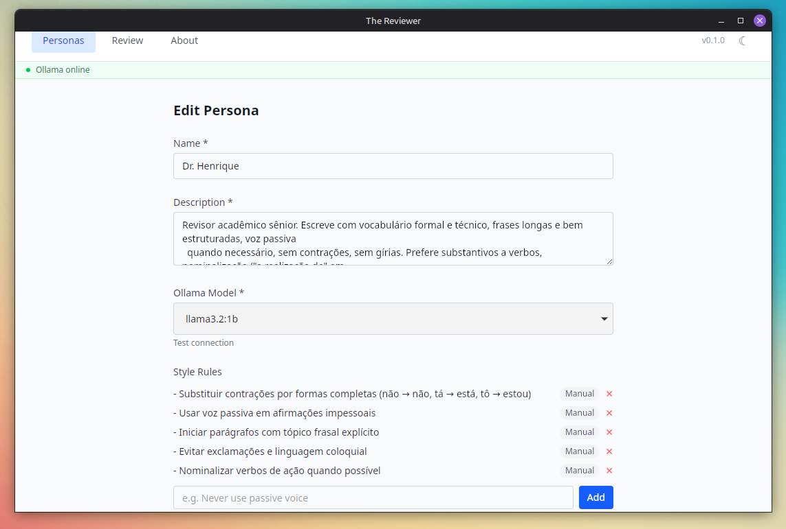
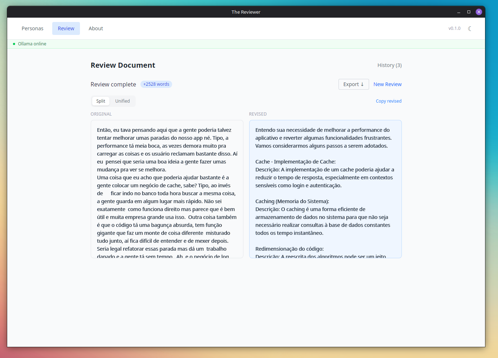
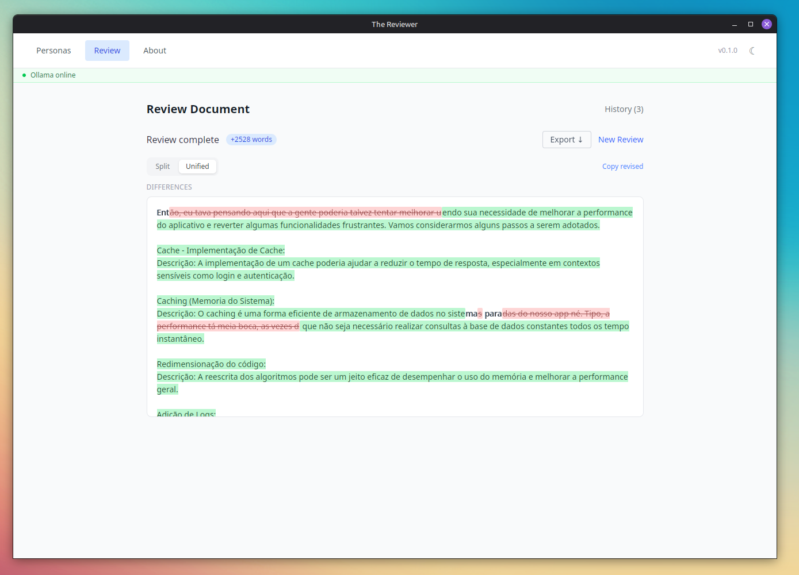
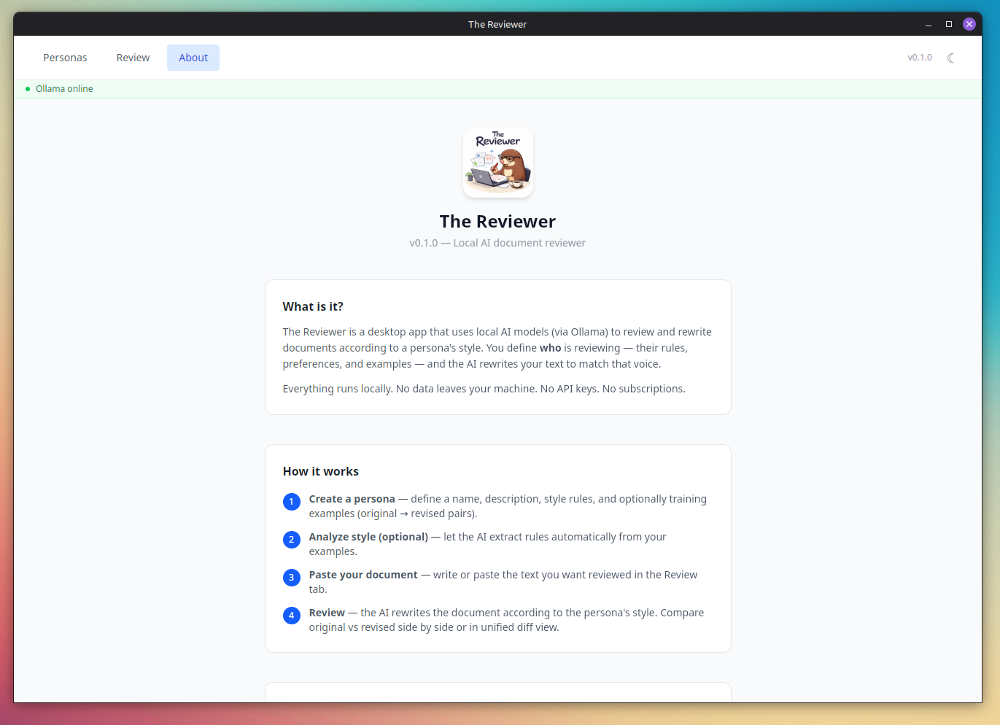

<p align="center">
  
</p>

# The Reviewer

> A desktop app that reviews documents in the writing style of real people — 100% local, no cloud, no subscriptions.

**The Reviewer** lets you create AI-powered **personas** trained on the writing preferences of real reviewers. Give it examples of how someone writes, and it will rewrite any document the way they would — preserving their tone, vocabulary, structure, and habits.

Everything runs locally via [Ollama](https://ollama.com). Your documents never leave your machine.

---

## Screenshots

| Persona List | Edit Persona |
|---|---|
|  |  |

| Review (Split) | Review (Unified) |
|---|---|
|  |  |

| About |
|---|
|  |

---

## How it works

1. **Create a persona** — give them a name (e.g. "Rafael") and a description of their writing style
2. **Add examples** — paste documents they wrote before (original → revised pairs)
3. **Analyze style with AI** _(optional)_ — automatically generate writing rules from the examples
4. **Submit a document** — the persona rewrites it in their style, streaming the result in real time
5. **Review the diff** — see exactly what changed, side by side

---

## Features

- **Persona management** — create, edit, and delete reviewer personas with custom styles and rules
- **AI style analysis** — extract writing rules automatically from before/after examples
- **Streaming review** — see the rewritten document appear word by word in real time
- **Diff viewer** — side-by-side comparison of original vs. reviewed document
- **Review history** — browse all past reviews per persona
- **Ollama status banner** — live feedback if the local AI server is offline
- **100% local** — no API keys, no internet required, no data leaves your machine

---

## Prerequisites

| Requirement | Version |
|---|---|
| [Node.js](https://nodejs.org) | v20+ |
| [pnpm](https://pnpm.io) | v10+ |
| [Rust](https://rustup.rs) | stable toolchain |
| [Ollama](https://ollama.com) | any recent version |

### System dependencies (Linux only)

```bash
sudo apt install -y \
  libglib2.0-dev \
  libgtk-3-dev \
  libsoup-3.0-dev \
  libjavascriptcoregtk-4.1-dev \
  libwebkit2gtk-4.1-dev
```

---

## Installation

```bash
# Clone the repository
git clone https://github.com/joaoagr1/the-reviewer.git
cd the-reviewer

# Install frontend dependencies
pnpm install
```

---

## Running in development

You need two terminals:

```bash
# Terminal 1 — start Ollama
ollama serve

# Pull a model if you don't have one yet
ollama pull llama3.2
```

```bash
# Terminal 2 — start the app
pnpm tauri dev
```

> The first run will compile the Rust backend, which takes a few minutes. Subsequent runs are much faster.

**Already have Ollama running?** You can skip Terminal 1. To check:

```bash
curl http://localhost:11434/api/tags
```

If it returns JSON, Ollama is already up.

---

## Building for production

```bash
pnpm tauri build
```

The binary will be generated at `src-tauri/target/release/`.

Packaged installers (`.deb`, `.AppImage`, `.dmg`, `.msi`) will be in `src-tauri/target/release/bundle/`.

---

## Running tests

```bash
# Frontend tests (Vitest + Testing Library)
pnpm test

# Watch mode
pnpm test:watch

# Coverage report
pnpm test:coverage

# Backend tests (Rust)
cd src-tauri && cargo test
```

---

## Project structure

```
the-reviewer/
├── src/
│   ├── domain/          # Pure types and business logic
│   │   ├── persona.ts
│   │   ├── prompt.ts
│   │   └── review.ts
│   ├── services/        # Ollama and Tauri integrations
│   │   ├── ollamaService.ts
│   │   └── personaService.ts
│   ├── store/           # Zustand state management
│   │   ├── personaStore.ts
│   │   └── reviewStore.ts
│   ├── components/
│   │   ├── personas/    # PersonaList, PersonaForm, RulesEditor, ExampleEditor
│   │   └── review/      # DocumentInput, DiffViewer, ReviewResult, ReviewHistory
│   └── pages/
│       ├── PersonasPage.tsx
│       └── ReviewPage.tsx
├── src-tauri/
│   └── src/
│       ├── models.rs
│       ├── storage/fs.rs
│       └── commands/    # persona.rs, review.rs
└── README.md
```

---

## Tech stack

| Layer | Technology |
|---|---|
| Desktop shell | Tauri v2 (Rust) |
| Frontend | React 19 + TypeScript |
| Styling | Tailwind CSS v4 |
| State management | Zustand v5 |
| Routing | React Router v7 |
| LLM | Ollama (local inference) |
| Persistence | Filesystem JSON via Tauri commands |
| Testing | Vitest + Testing Library + Rust built-in tests |
| Build tool | Vite |

---

## Data storage

All data is stored locally on your machine. No accounts, no cloud sync.

| Platform | Location |
|---|---|
| Linux | `~/.local/share/the-reviewer/` |
| macOS | `~/Library/Application Support/the-reviewer/` |
| Windows | `%APPDATA%\the-reviewer\` |

---

## Contributing

Contributions are welcome! Here's how to get started:

1. Fork the repository
2. Create a feature branch: `git checkout -b feature/my-feature`
3. Make your changes following the existing patterns
4. Write or update tests — this project follows TDD (Red → Green → Refactor)
5. Commit with a clear message: `add/fix/refactor/test/docs: description`
6. Open a pull request

Please make sure all tests pass before submitting:

```bash
pnpm test && cd src-tauri && cargo test
```

---

## Roadmap

- [ ] Export reviewed documents (PDF, DOCX)
- [ ] Import personas from file (share between machines)
- [ ] Support for multiple Ollama models per persona
- [ ] Dark / light theme toggle
- [ ] Keyboard shortcuts
- [ ] Windows and macOS installers published to GitHub Releases

---

## License

This project is licensed under the **MIT License** — see the [LICENSE](LICENSE) file for details.

You are free to use, copy, modify, merge, publish, distribute, sublicense, and/or sell copies of this software, provided the original copyright notice and this permission notice are included.
